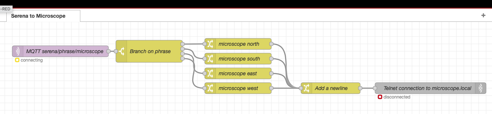

# Serena - a wearable nonintelligent speech agent

The code is based on the en_speech_commands_recognition example from the
esp-skainet package.   The concept is based on...well, Blade Runner,
Dune, The Gripping Hand and a whole lot of the collective Sci-Fi gestalt.

## How to use this project

**Voice input**: Choose a supported ESP32 + Microphone platform.  I'm using the ESP32
Korvo dev kit.  Your voice input device will convert speech to MQTT messages.

**Command routing**: You will need an MQTT server.   That could be a raspberry pi, your PC,
or if you have a Home Assistant server, install the mosquitto plug in
on that. 

**Action performance**: Your devices can be anything that speaks
MQTT - any ESP32 development is a suitable platform.   Your devices
will connect to the MQTT server and subscribe to relevant topic
patterns.  If you use the Home Assistant and/or ESPhome platforms, you
can potentially build no-code action devices.

### Additional Hardware Required

\- A Speaker, if you want your voice platform to also play feedback
sounds


### Configure, Build and Flash


##### once only - set target microcontroller variant 

```
idf.py set-target esp32s3
```

##### once only - configure wifi and mqtt settintgs

Select the default sdkconfig according to the development board
module.

Edit main/CMakeLists.txt and enable USE_KORVO or other

For example:  

```
cp sdkconfig.defaults.esp32s3 sdkconfig
```

Now you can build upon the dfeaults

```
idf.py menuconfig
```

The settiongs in "Example Connection Configuration" are the key place
to look.   More info [here](https://developer.espressif.com/blog/getting-started-with-wifi-on-esp-idf/)

##### build&flash

Build the project and flash it to the board, then run the monitor tool to view the output via serial port:

```
idf.py -b 2000000 flash monitor 
```

(To exit the serial monitor, type ``Ctrl-]``.)

### Modify speech commands

#### modification procedure From the original example

We recommend using MultiNet6 or newer models.   
Here's a simple example to modify speech commands in the code.  
You can also modify the default command list, please refer to [document](https://docs.espressif.com/projects/esp-sr/en/latest/esp32s3/speech_command_recognition/README.html) for more details.

```
// MultiNet6
    // Note: Please create multinet handle before adding speech commands

    esp_mn_commands_clear();                       // Clear commands that already exist 
    esp_mn_commands_add(1, "turn on the light");   // add a command
    esp_mn_commands_add(2, "turn off the light");  // add a command
    esp_mn_commands_update();                      // update commands
    multinet->print_active_speech_commands(model_data);     // print active commands
```

#### Modifying speech commands in this project

I've created a tree structure, so there is a "current vocabulary"
which consists of recommending commands for a particular task, plus
the global commands for changing vocabularies and other universal
actions.

## Hardware examples

### XY microscope stage

Using the [FluidNC](https://fluidnc.com/) project for Computer Numeric
Control you can voice control various things  using stepper or servo
motors.

To glue Serena's MQTT to FluidNC's telnet interface and macro
programs, I used a [NodeRed](https://nodered.org) flow that listens
for phrases over MQTT and invokes macros on FluidNC.   Since I already
use HomeAssistant, I installed NodeRed as a plugin on my HomeAssistant
server, but you can also run it on any PC, laptop or single-board
computer.   Node-red has been running my office security system for
nearly a decade now.



You can create the above flow by using NodeRed's import operation to
load the file [nodered-microscope.json](nodered-microscope.json).

### Servo magnifying visor

Using [ESPhome](https://esphome.io) I modified a magnifying visor to
have a servo motor that raises and lowers the lense.  See the file
[esphome-visorservo.yaml](esphome-visorservo.yaml) which is a
configuration file for ESPhome that allows the visor to be controlled
by Serena (also on-board buttons if you prefer).

### Auto-Solder station

Again using [FluidNC](https://fluidnc.com/) I build a rig to position
my soldering iron and feed solder.   When doing production assembly of
connectors and PCB headers this saves a lot of time.

